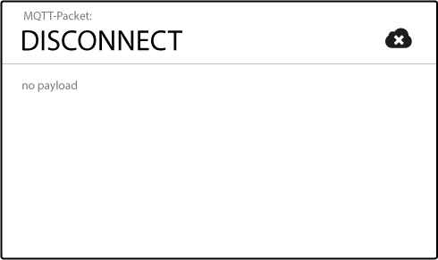

# Chapter 3. Documentation and study of MQTT protocol

## Introduction to MQTT

MQTT is a Client/Server publish/subscribe messaging transport protocol. It is lightweight, open, simple, and designed so as to be easy to implement. These characteristics make it ideal for use in many situations, including constrained environments such as for communication in Machine to Machine (M2M) and Internet of Things (IoT) contexts where a small code footprint is required and/or network bandwidth is at a premium. Its features include:

-   Use of the publish/subscribe message pattern which provides one-to-many message distribution and decoupling of applications.

-   A messaging transport that is agnostic to the content of the payload.

-   Three qualities of service for message delivery:

    -   "At most once", where messages are delivered according to the best efforts of the operating environment and underlying transport protocol. Message loss can occur. This level could be used, for example, with ambient sensor data where it does not matter if an individual reading is lost as the next one will be published soon after.

    -   "At least once", where messages are assured to arrive but duplicates can occur.

    -   "Exactly once", where message are assured to arrive exactly one time. This level could be used, for example, with billing systems where duplicate or lost messages could lead to incorrect charges being applied.

-   A small transport overhead and protocol exchanges minimized to reduce network traffic.

-   A mechanism to notify interested parties when an abnormal disconnection occurs.

## Architecture

MQTT has a client/server model, where every node is a client and connects to a server, known as a broker, usually over TCP/IP, but can run over any other network protocols that provide ordered, lossless and bi-directional connections.

MQTT is message oriented. Every message is a discrete chunk of data, opaque to the broker.

Every message is published to an address, known as a topic. Clients may subscribe to multiple topics. Every client subscribed to a topic receives every message published to the topic.

## History of the prococol

MQTT was invented by Andy Stanford-Clark (IBM) and Arlen Nipper (Arcom Control Systems) back in 1999, when their use case was to create a protocol for minimal battery loss and minimal bandwidth connecting oil pipelines over satellite connection. They specified the following goals, which the future protocol should have:

-   Simple to implement

-   Provide a Quality of Service Data Delivery

-   Lightweight and Bandwidth Efficient

-   Data Agnostic

-   Continuous Session Awareness

These goals are still the core of MQTT, while the focus has changed from proprietary embedded systems to open Internet of Things use cases.

The name MQTT comes from “MQ Telemetry Transport”, referencing to IBM MQ Series, a family of message-oriented middleware products which originally supported MQTT, however, MQTT don't use queues as in traditional message queuing solutions, although in some cases is possible to hold certain messages on memory until they are delivered to the client.

After MQTT had been used by IBM internally, version 3.1 was released royalty free in 2010. Since then everybody could implement and use it. In addition to the protocol specification, also various client implementation were contributed to the newly founded Paho project underneath the Eclipse Foundation. This was definitely positive for the protocol because there is little chance for wide adoption when there is no ecosystem around it.

Around 3 years after the initial publication, it was announced that MQTT should be standardized under the wings of OASIS (Organization for the Advancement of Structured Information Standards), a global nonprofit consortium that works on the development, convergence, and adoption of standards for security, Internet of Things, energy, content technologies, emergency management, and other areas.

The standardization process took around 1 year and on October 29th 2014 MQTT was officially approved as OASIS Standard.

MQTT 3.1.1 is now the actual version of the protocol. The minor version change from 3.1 to 3.1.1 symbolizes that there were only little changes made to the previous version. The primary goal was to deliver a standard as soon as possible and improve MQTT from there on. There is also a variant of the main protocol called MQTT-SN addressed to devices integrated into sensor networks using UDP transport layer or mesh network topology like ZigBee.

MQTT 3.1.1 was accepted as an ISO/IEC standard at the end of January 2016 (ISO is the International Organization for Standardization and IEC is the International Electrotechnical Commission). Voting for the ISO/IEC 20922 standard it was closed with the approval of 100% and was published in mid-June 2016.

## Benefits of MQTT

### Publish/Subscribe pattern

The Pub/Sub (publish/subscribe) pattern is an alternative to the traditional client-server model, where a client communicates directly with an endpoint. However, Pub/Sub decouples a client who is sending a particular message, called publisher, from one or more clients who are receiving the message, called subscribers. This means that the publisher and subscriber don’t know about the existence of one another. There is a third component, called broker, which is known by both the publisher and subscriber, which filters all incoming messages and distributes them accordingly.

The broker is responsible for subscriptions, persistent sessions, lost messages and security in general, including authentication and authorization.

### Scalability

Pub/Sub also provides a greater scalability than the traditional client-server approach. This is because operations on the broker can be highly parallelized and processed event-driven. Also often message caching and intelligent routing of messages is decisive for improving the scalability. But it is definitely a challenge to scale publish/subscribe to millions of connections. This can be achieved using clustered broker nodes in order to distribute the load over more individual servers with load balancers.

### Space decoupling

While the node and the broker need to have each other’s IP address, nodes can publish information and subscribe to other nodes’ published information without any knowledge of each other, since everything goes through the central broker. This reduces overhead that can accompany TCP sessions and ports, and allows the end nodes to operate independently of one another.

### Time decoupling

A node can publish its information regardless of other nodes’ states. Other nodes can then receive the published information from the broker when they are active. This allows nodes to remain in sleepy states even when other nodes are publishing messages directly relevant to them.

### Synchronization decoupling

A node that’s in the midst of one operation is not interrupted to receive a published message to which it’s subscribed. The message is queued by the broker until the receiving node is finished with its existing operation. This saves operating current and reduces repeated operations by avoiding interruptions of ongoing operations or sleepy states.

### Authentication

When it comes to authentication, MQTT protocol itself provides user and password fields in the *CONNECT* message. Therefore, a customer has the ability to send a user name and password when connecting to a broker MQTT

The user name is a UTF-8 encoded string and password is binary data with a maximun lenght of 65535 bytes. The specification also states that a user name without password is possible, in the other hand, it’s not possible to just send a password without a username.

When using the built-in username/password authentication, the MQTT broker will evaluate the credential based on the implemented authentication mechanism and return one of the following return codes:
-   0 (Connection Accepted)
-   4 (Connection Refused, bad username or password)
-   5 (Connection Refused, not authorized)

When setting username and password on the client, it will be sent to the broker in plain text which would allow eavesdropping by an attacker and an easy way of obtaining the credentials. The only way to guarantee a completely secure transmission of username and password is to use transport layer encryption.

#### Client Identification

Every MQTT client has a unique client identifier which is provided by the client in the MQTT *CONNECT* message. This unique identifier can be up to 65535 characters making a common practice to use 36 character long uuids or any other unique information available to the client like the MAC address of the network module or the serial number of the device itself. In the authentication process client ids are often used in addition to username and password. A common example to confirm if a client can access the MQTT broker is to validate username/password and the correct client id for that credential combination. While it’s not a good security practice, it’s also possible to ignore the username/password and just authenticate against the client identifier. For a closed system this kind of authentication may be enough.

#### X.509 Certificates

Another possible authentication source from the client is a X.509 client certificate, which will be presented to the broker during the TLS handshake. Some brokers allow to use the information in the certificate for application layer authentication after the TLS handshake already succeeded. This enables the broker to read all informations contained in the certificate and use it for authentication purposes as well.

### Quality of Service (QoS)

The Quality of Service (QoS) level is an agreement between sender and receiver of a message regarding the guarantees of delivering a message. QoS is a major feature of MQTT as it makes communication in unreliable networks a lot easier because the protocol handles retransmission and guarantees the delivery of the message, regardless how unreliable the underlying transport is. Also it empowers a client to choose the QoS level depending on its network reliability and application logic.

-   The minimal level is zero and it guarantees a best effort delivery. A message won’t be acknowledged by the receiver or stored and redelivered by the sender. This is often called “fire and forget” and provides the same guarantee as the underlying TCP protocol.

-   When using QoS level 1, it is guaranteed that a message will be delivered at least once to the receiver. But the message can also be delivered more than once. The sender will store the message until it gets an acknowledgement in form of a PUBACK command message from the receiver.

-   The highest QoS is 2, it guarantees that each message is received only once by the counterpart. It is the safest and also the slowest quality of service level. The guarantee is provided by two flows there and back between sender and receiver.

### Last Will and Testament

MQTT is often used in scenarios were unreliable networks are very common. Therefore it is assumed that some clients will disconnect ungracefully from time to time, because they lost the connection, the battery is empty or any other imaginable case. Therefore it would be good to know, if a connected client has disconnected with a MQTT *DISCONNECT* message or not, in order to take appropriate action.

A connecting client will provide his will in form of an MQTT message and topic in the *CONNECT* message. If this clients disappears without previous notification, the broker sends this message on behalf of the client to all subscribers.

### Subject-based filtering

MQTT uses subject-based filtering of messages. So each message contains a topic, which the broker uses to find out, if a subscribing client will receive the message or not. Topics are created by the publisher node and nodes wishing to receive messages should subscribe to them. The communication can be one to one or one to many.

A topic is represented by a string and has a hierarchical structure whose levels are separated using the slash (/) character. In this way customers can create hierarchies that publish and receive data.

A MQTT node can subscribe to any specific topic within the hierarchy or use single-level (+) or multi-level (\#) wildcards to subscribe several topics at once. This allows a minimal amount of code and, therefore, reduce memory size and cost.

MQTT differs from traditional message queue protocols in the following points:

-   **A message queue stores messages until they are consumed.** When using message queues, each incoming message will be stored on that queue until it is picked up by any client (often called consumer). Otherwise the message will just be stuck in the queue and waits for getting consumed. It is not possible that message are not processed by any client, like it is in MQTT if nobody subscribes to a topic.

-   **A message will only be consumed by one client.** Another big difference is the fact that in a traditional queue a message is processed by only one consumer. So that the load can be distributed between all consumers for a particular queue. In MQTT it is quite the opposite, every subscriber gets the message, if they subscribed to the topic.

-   **Queues are named and must be created explicitly.** A queue is far more inflexible than a topic. Before using a queue it has to be created explicitly with a separate command. Only after that it is possible to publish or consume messages. In MQTT topics are extremely flexible and can be created on the fly.

## Drawbacks of MQTT

### Central Broker

The use of a central broker can be inconvenient for distributed IoT systems. For example, a system can start small with a remote control and a window shade, which does not require a central broker. Then, as the system grows, for example, adding safety sensors, light bulbs or other blinds, the network naturally grows and expands, and may have need for a central broker. However, none of the individual nodes want to assume the cost and responsibility, as it requires resources, software and complexity that are not critical to the function of end node.

In systems that already have a central broker, it can become a single point of failure for the entire network. For example, if the broker is a node powered without a battery backup, then battery-powered nodes can continue to function during a power outage, while the broker is offline, leaving the network inoperable.

### Transport layer protocol

Even though MQTT is designed to be lightweight, every MQTT client must support TCP and will typically hold a connection open to the broker at all times. For some environments where packet loss is high or computing resources are scarce, this is a problem.

TCP was originally designed for devices with more memory and processing resources than may be available in typical IoT constrained-node networks. The TCP protocol requires that connections be established in a multi-step handshake process before any messages are exchanged. This drives up wake-up and communication times, and reduces battery life over the long run. Also, in TCP, it’s ideal for two communicating nodes to hold their TCP sockets open for each other continuously with a persistent session, which again may be difficult with energy- and resource-constrained devices.

Using TCP without session persistence can require incremental transmit time for connection establishment. For nodes with periodic, repetitive traffic, this can lead to lower operating life.

These shortcomings are addressed by the MQTT-SN protocol, which defines a UDP mapping of MQTT and adds broker support for indexing topic names so it can be implemented in a practical IEEE 802.15.4 deployments.

### Security

MQTT uses unencrypted TCP and is not “out-of-the-box” secure. However, because it uses TCP, it can and should use TLS/SSL Internet security. TLS is a very secure method for encrypting traffic, but is also resource-intensive for lightweight clients due to its required handshake and increased packet overhead. For networks where energy is a very high priority and security much less so, encrypting just the packet payload may suffice.

### No TTL (Time-To-Live) on messages

The protocol does not allow to add a TTL attribute per message. So if you use the *cleanSession* parameter, the message will be held indefinitely in the broker. As time goes by, it could create a lot of messages on the broker, so it could affect the overall performances, and use some disk space if you persist the messages.

A possible workaround for this is to periodically check the topics for old messages, but you only get a TTL per topics, not at message level. But it seems that this limitation should be addressed in a next release of the protocol. This way referes to broker’s internal TTL mechanisms.

## Formato de los paquetes de control MQTT

El protocolo MQTT funciona mediante el intercambio de una serie de paquetes de control de una manera definida. En esta sección se describe el formato de estos paquetes.

| Cabecera fija, presente en todos los paquetes de control MQTT   |
|-----------------------------------------------------------------|
| Cabecera variable, presente en algunos paquetes de control MQTT |
| Carga útil, presente en algunos paquetes de control MQTT        |

Table: Estructura de un control de paquetes MQTT

Un paquete de control MQTT se compone de una parte fija de la cabecera, una parte variable que solamente está presente en algunos tipos de paquetes y la carga útil.

<table>
  <thead>
    <tr class="header">
      <th>Bit</th>
      <th>7</th>
      <th>6</th>
      <th>5</th>
      <th>4</th>
      <th>3</th>
      <th>2</th>
      <th>1</th>
      <th>0</th>
    </tr>
  </thead>
  <tbody>
    <tr class="odd">
      <td>Byte 1</td>
      <td colspan="4">Tipo de paquete de control MQTT</td>
      <td>DUP</td>
      <td colspan="2">QoS level</td>
      <td>RETAIN</td>
    </tr>
    <tr class="even">
      <td>Byte 2</td>
      <td colspan="8">Longitud restante</td>
    </tr>
  </tbody>
</table>

Table: Formato de cabecera fijo

La parte fija de la cabecera se compone de 4 bits que indican el tipo de paquete e banderas específicas para tipo de paquete.

| Nombre      | Valor | Dirección del flujo | Descripción                                         |
|-------------|-------|---------------------|-----------------------------------------------------|
| Reservado   | 0     | Prohibido           | Reservado                                           |
| CONNECT     | 1     | Cliente a servidor  | Solicitud de conexión del cliente al servidor       |
| CONNACK     | 2     | Servidor a cliente  | Confirmación de la conexión                         |
| PUBLISH     | 3     | Ambos               | Publicar mensaje                                    |
| PUBACK      | 4     | Ambos               | Confirmación de la publicación                      |
| PUBREC      | 5     | Ambos               | Recepción de la publicación (Envío fiable parte 1)  |
| PUBREL      | 6     | Ambos               | Liberación de la publicación (Envío fiable parte 2) |
| PUBCOMP     | 7     | Ambos               | Publicación completa (Envío fiable parte 3)         |
| SUBSCRIBE   | 8     | Cliente a servidor  | Solicitud de suscripción del cliente                |
| SUBACK      | 9     | Servidor a cliente  | Confirmación de la suscripción                      |
| UNSUBSCRIBE | 10    | Cliente a servidor  | Solicitud de cancelar suscripción del cliente       |
| UNSUBACK    | 11    | Servidor a cliente  | Confirmación de la cancelación de suscripción       |
| PINGREQ     | 12    | Cliente a servidor  | Solicitud de PING                                   |
| PINGRESP    | 13    | Servidor a cliente  | Respuesta de PING                                   |
| DISCONNECT  | 14    | Cliente a servidor  | Desconexión del cliente                             |
| Reservado   | 15    | Prohibido           | Reservado                                           |

Table: Tipos de paquetes de control

La tabla muestra todos los mensajes que componen el protocolo MQTT. Los más importantes son *CONNECT*, *PUBLISH*, *SUBSCRIBE*, *UNSUBSCRIBE* y *DISCONNECT*. Los demás son mensajes de confirmación (*CONNACK*, *PUBACK*, *SUBACK*, *UNSUBACK*) o mensajes relacionados con la calidad de servicio de los mensajes PUBLISH (*PUBACK*, *PUBREL*, *PUBREL* y *PUBCOMP*).

Por último, puede haber una parte opcional de la cabecera que se encuentra entre la parte fija y el cuerpo del mensaje. Esta parte variable depende del tipo de paquete. Un campo común es el identificador del paquete.

## Descripción de los paquetes de control MQTT

### CONNECT

Después que una conexión de red es establecida por un cliente a un servidor, el primer paquete enviado desde el cliente al servidor debe ser un paquete de conexión.

Un cliente sólo puede enviar el paquete de conexión una vez durante una conexión de red. El servidor debe procesar un segundo paquete de conexión enviado desde un cliente como una violación del protocolo y desconectar el Cliente

La carga útil contiene uno o más campos codificados. En ellos se especifica un identificador de cliente único para el nodo, un tema y mensaje para el testamento, nombre de usuario y contraseña. Todos menos el identificador de cliente son opcionales y su presencia se determina con base en las banderas en la cabecera variable.

#### Client Id

El ClientId es un identificador único de cada nodo para conectarse a un bróker MQTT. El bróker lo utiliza para identificar el cliente y el estado actual del cliente. Si no necesita que se mantenga el estado por el bróker, en MQTT 3.1.1 (estándar actual) también es posible enviar un ClientId vacío, lo que se traduce en una conexión sin estado, para esto CleanSession debe ser verdadero, de lo contrario la conexión será rechazada.

#### Clean Session

La bandera de sesión limpia indica al bróker, si el cliente quiere establecer una sesión persistente o no. Una sesión persistente (CleanSession es falso) significa, que el bróker va a almacenar todas las suscripciones para el cliente y también todos los mensajes perdidos, cuando se suscriben con QoS 1 ó 2. Si la sesión limpia se establece en verdadera, el bróker no almacenará nada para el cliente y también purgará toda la información existente de una sesión persistente anterior. La siguiente información se almacena en una sesión persistente:

-   Existencia de una sesión, incluso si no hay suscripciones

-   Todas las suscripciones

-   Todos los mensajes con QoS 1 ó 2 que no han sido confirmados por el cliente

-   Todos los nuevos mensajes con QoS 1 ó 2 que el cliente ha perdido mientras estaba sin conexión

-   Todos los mensajes recibidos con QoS 2 que aún no se han confirmado al cliente

Al igual que en el bróker, cada cliente MQTT debe almacenar una sesión persistente también. Así que cuando un cliente solicita al servidor almacenar los datos de sesión, también tiene la responsabilidad de mantener cierta información por sí mismo:

-   Todos los mensajes con QoS 1 ó 2, que no han sido confirmados por el bróker

-   Todos los mensajes recibidos con QoS 2, que aún no han sido confirmados por el bróker

#### Username/Password

MQTT permite enviar un nombre de usuario y una contraseña para la autenticación y autorización del cliente. Sin embargo, la contraseña se envía en texto plano, si no está cifrada, se aplica un algoritmo hash o se utiliza TLS por debajo. Es muy recomendable utilizar nombre de usuario y contraseña junto con un transporte seguro de la misma.

#### Last Will

The Last Will and Testament (LWT) feature is used in MQTT to notify other clients about an ungracefully disconnected client. Each client can specify its last will message (a normal MQTT message with topic, retained flag, QoS and payload) when connecting to a broker. The broker will store the message until it detects that the client has disconnected ungracefully. If the client disconnect abruptly, the broker sends the message to all subscribed clients on the topic, which was specified in the last will message. The stored LWT message will be discarded if a client disconnects gracefully by sending a *DISCONNECT* message.

According to the MQTT 3.1.1 specification the broker will distribute the LWT of a client in the following cases:

-   An I/O error or network failure is detected by the server.
-   The client fails to communicate within the Keep Alive time.
-   The client closes the network connection without sending a *DISCONNECT* packet first.
-   The server closes the network connection because of a protocol error.

#### Keep Alive

La funcionalidad de mantenimiento de conexión asegura que esta sigue abierta y ambos el bróker y el cliente están conectados el uno al otro. Para esto el cliente especifica un intervalo de tiempo en segundos y la comunica al bróker durante el establecimiento de la conexión. El intervalo es el período más largo de tiempo posible, que el bróker y el cliente pueden aguantar sin necesidad de enviar un mensaje.

Eso significa que siempre que se intercambian mensajes con frecuencia y no se sobrepase el intervalo de mantenimiento de conexión, no hay necesidad de enviar un mensaje adicional para asegurar que la conexión sigue abierta. Pero si el cliente no envía ningún mensaje durante el período del mantenimiento de conexión se debe enviar un paquete PINGREQ al bróker para confirmar su disponibilidad y también asegurarse de que el bróker está todavía disponible. El bróker debe desconectar a un cliente, que no envía PINGREQ o cualquier otro mensaje en una vez y media del intervalo de mantenimiento de conexión. Asimismo, el cliente debe cerrar la conexión si la respuesta del bróker no se recibe en un plazo de tiempo razonable.

### CONNACK

Cuando un bróker obtiene un mensaje CONNECT, que está obligado a responder con un mensaje CONNACK. El paquete CONNACK contiene sólo dos entradas de datos: la bandera de sesión presente y el código de retorno.

#### Session Present

La bandera de sesión presente indica, si el corredor ya tiene una sesión persistente del cliente a partir de interacciones anteriores. Si un cliente se conecta y se ha fijado CleanSession como verdadera, esta bandera es siempre falsa, porque no hay ninguna sesión disponible. Si el cliente ha establecido CleanSession como falsa, la bandera es dependiendo de, si hay información de sesión disponible para el ClientId. Si la información de sesión almacenada existe, entonces el indicador es verdadero y de lo contrario es falso.

#### Return Code

La segunda bandera en el CONNACK indica al cliente, si el intento de conexión se ha realizado correctamente y de otra manera cuál es el problema. Si un paquete CONNECT bien formado es recibido por el servidor, pero el servidor no puede procesar por alguna razón, entonces el servidor debe intentar enviar un paquete CONNACK que contiene el código de retorno distinto de cero apropiada de esta tabla. Si un servidor envía un paquete CONNACK que contiene un código de retorno distinto de cero se deberá cerrar la conexión de red a continuación.

| CÓDIGO DE RETORNO | DESCRIPCIÓN DEL CÓDIGO DE RETORNO                             |
|-------------------|---------------------------------------------------------------|
| 0                 | Conexión aceptada                                             |
| 1                 | Conexión rechazada, versión del protocolo inaceptable         |
| 2                 | Conexión rechazada, identificador rechazado                   |
| 3                 | Conexión rechazada, servidor no disponible                    |
| 4                 | Conexión rechazada, nombre de usuario o contraseña incorrecta |
| 5                 | Conexión rechazada, no autorizado                             |

>Figura 6. Códigos de retorno para conexiones

### PUBLISH

Cuando un cliente MQTT se conecta a un bróker puede entonces empezar a publicar mensajes. Cada mensaje MQTT debe contener un topic, que será utilizado por el bróker para reenviar el mensaje a los clientes interesados. Cada mensaje tiene típicamente una carga útil que contiene los datos reales a transmitir en formato de bytes. MQTT es independiente de los datos y depende totalmente del caso de uso cómo se estructura la carga útil. Es completamente decisión del remitente si desea enviar datos binarios, datos textuales o incluso XML o JSON de pleno derecho.

#### Packet Identifier

El identificador de paquete es un identificador único entre el cliente y el bróker para identificar un mensaje en un flujo de mensajes. Esto sólo es relevante para QoS mayor que cero.

#### Topic

Una cadena de caracteres UTF-8 sencilla, que está jerárquicamente estructurada con barras diagonales “/” como delimitadores.

En comparación con una cola de mensajes un topic es muy ligero. No hay necesidad para un cliente de crear el topic deseado antes de publicar o suscribirse a él, porque un bróker acepta cada topic válido sin ninguna inicialización previa. Notable es que cada topic tiene que tener al menos 1 carácter para ser válido y también puede contener espacios, además un topic distingue mayúsculas de minúsculas.

Cuando un cliente se suscribe a un topic puede utilizar el topic exactamente donde el mensaje se publicó o puede suscribirse a más temas a la vez mediante el uso de comodines. Un comodín sólo se puede utilizar al suscribirse a temas y no se permite al publicar un mensaje. A continuación, vamos a ver los dos tipos diferentes de comodines: de nivel único y multinivel.

-   Como su nombre sugiere, un comodín de nivel único es un sustituto para un nivel de topic. El símbolo de suma “+” representa un comodín de nivel único en el topic. Cualquier topic coincide con un topic incluyendo el comodín de nivel único si contiene una cadena arbitraria en lugar del comodín.

-   Mientras que el comodín de nivel único sólo cubre un nivel de topic, el comodín multinivel cubre un número arbitrario de niveles de topic. El símbolo de almohadilla “\#” representa un comodín multinivel. Con el fin de determinar los topics coincidentes se requiere que el comodín multinivel sea siempre el último carácter en el topic y que está precedido por una barra inclinada.

En general, eres totalmente libre al nombrar tus topics, pero hay una excepción. Cuando topic comienza con un símbolo “$” será tratado de forma especial y por ejemplo no forma parte de la suscripción al suscribirse a \#. Estos topics están reservados para las estadísticas internas del bróker MQTT. Por lo tanto, no es posible para los clientes publicar mensajes a estos topics. Por el momento no hay una estandarización oficial clara de topics que deben ser publicados por el bróker, pero es una práctica común el uso de “$SYS/” para toda esta información y la mayoría de brókers lo usan, aunque con diferentes formatos.

#### QoS

Un nivel de calidad de servicio (QoS) para este mensaje. El nivel (0,1 ó 2) determina la garantía de un mensaje de llegar al otro extremo (cliente o bróker). En MQTT, el protocolo de envío funciona de manera similar entre un publicador y el bróker y entre el bróker y un suscriptor.

En las figuras, los mensajes PUBLISH se muestran acompañados de tres números. El primer número corresponde al nivel de QoS, el segundo a la bandera de duplicado, el tercero representa el identificador del paquete. Aunque haya identificadores distintos, hay casos en los que aleatoriamente podrían haberse generado iguales.

-   QoS 0: Como mucho una vez. El mensaje PUBLISH se envía según las características de la red que hay por debajo. El receptor no envía ningún tipo de asentimiento ni se hace ningún reenvío. El mensaje llega al bróker una vez o ninguna, y si llega, llegará a cada uno de los suscriptores una vez o ninguna.

-   QoS 1: Al menos una vez. Este nivel de calidad de servicio se asegura de que el mensaje llega al receptor al menos una vez. Un paquete PUBLISH con QoS 1 tiene un identificador de paquete en la cabecera y se debe asentir con un paquete PUBACK. El lado que envía debe asignar un identificador de paquete único cada vez que publica un nuevo mensaje de aplicación. Hasta que se reciba el paquete PUBACK del receptor el paquete se trata como “sin confirmar”. Una vez que se envía el PUBACK el receptor debe tratar cualquier otra publicación con el mismo identificador como una nueva publicación, independientemente del valor de la bandera DUP.

-   QoS 2: Exactamente una vez. Es la mejor calidad de servicio, cuando no se quieren pérdidas ni duplicación. En el nivel 2 de QoS, el lado emisor debe asignar también un identificador de paquete único, tratando como “sin asentir” un paquete si no ha recibido un paquete PUBREC con el mismo identificador desde el receptor. También debe enviar un paquete PUBREL que contenga el mismo identificador de paquete una vez recibe el PUBREC, tratando a este como “sin asentir” hasta la recepción del paquete PUBCOMP correspondiente (con el mismo identificador) del lado receptor. Una vez recibe el paquete PUBREL no debe reenviar el paquete PUBLISH original. Por otro lado, el lado receptor debe asentir cada paquete PUBLISH con el mismo identificador con un paquete PUBREC hasta que recibe el paquete PUBREL. Una vez envía el paquete PUBCOMP, el receptor debe tratar cualquier paquete PUBLISH con el mismo identificador como una nueva publicación.

#### Retain

Esta bandera determina si el mensaje se guardará por el bróker en el topic especificado como el último valor correcto conocido. Los nuevos clientes que se suscriben a ese topic recibirán el último mensaje retenido en ese topic inmediatamente después de suscribirse.

#### Payload

Este es el contenido real del mensaje. MQTT de datos es totalmente independiente del, es posible enviar imágenes, textos en cualquier codificación, datos cifrados, y prácticamente cualquier dato en binario.

#### DUP

Esta bandera indica que este mensaje es un duplicado y se ha vuelto a enviar porque el otro extremo no confirmó el mensaje original. Esto sólo es relevante para QoS mayor que 0.

### PUBACK

Un paquete PUBACK es la respuesta a un paquete PUBLISH con nivel QoS 1.

#### Packet Identifier

El identificador de paquete es un identificador único que se utiliza para identificar un mensaje. contiene el identificador del paquete PUBLISH que está siendo confirmado.

### PUBREC

Un paquete PUBREC es la respuesta a un paquete PUBLISH con nivel QoS 2. Es el segundo paquete del intercambio de protocolo con nivel QoS 2.

#### Packet Identifier

El identificador de paquete es un identificador único que se utiliza para identificar un mensaje. contiene el identificador del paquete PUBLISH que está siendo confirmado.

### PUBREL

Un paquete PUBREL es la respuesta a un paquete PUBREC. Es el tercer paquete del intercambio de protocolo con nivel QoS 2.

#### Packet Identifier

El identificador de paquete es un identificador único que se utiliza para identificar un mensaje. contiene el identificador del paquete PUBREC que está siendo confirmado.

### PUBCOMP

El paquete PUBCOMP es la respuesta a un paquete PUBREL. Es el cuarto y último paquete del intercambio de protocolo con nivel QoS 2.

#### Packet Identifier

El identificador de paquete es un identificador único que se utiliza para identificar un mensaje. contiene el identificador del paquete PUBREL que está siendo confirmado.

### SUBSCRIBE

La publicación de mensajes no tiene sentido si nadie recibe el mensaje, o, en otras palabras, si no hay clientes que se suscriben a cualquier tema. Un cliente necesita enviar un paquete SUBSCRIBE al bróker MQTT con el fin de recibir mensajes relevantes. Un mensaje de suscripción es bastante simple, sólo contiene un identificador de paquete único y una lista de suscripciones.

#### Packet Identifier

El identificador de paquete es un identificador único entre el cliente y el bróker para identificar un mensaje en un flujo de mensajes. Esto sólo es relevante para QoS mayor que cero.

#### Topics

Un mensaje SUBSCRIBE puede contener un número arbitrario de suscripciones para un cliente. Cada suscripción es un par de topic y nivel de QoS. El topic en el mensaje de suscripción también puede contener comodines, lo que hace que sea posible suscribirse a ciertos patrones de topics. Si hay superposición de las suscripciones para un cliente, el nivel más alto de QoS para el topic será utilizado por el bróker para entregar el mensaje.

### SUBACK

Cada suscripción será confirmada por el bróker mediante el envío de una confirmación al cliente en forma de paquete SUBACK. Este mensaje contiene el mismo identificador de paquetes como el paquete SUBSCRIBE original (con el fin de identificar el mensaje) y una lista de códigos de retorno.

#### Packet Identifier

El identificador de paquete es un identificador único que se utiliza para identificar un mensaje. Es el mismo que en el paquete SUBSCRIBE.

#### Return Code

El bróker envía un código de retorno para cada par de topic / QoS que se recibió en el paquete SUBSCRIBE. Así que si el paquete SUBSCRIBE tenía 5 suscripciones, habrá 5 códigos de retorno para reconocer cada topic con el nivel de calidad de servicio otorgada por el bróker. Si la suscripción fue prohibida por el bróker (por ejemplo, si al cliente no se le permitió suscribirse a este topic debido a permisos insuficientes o si el topic tiene un formato incorrecto), el agente responderá con un código de retorno fracaso para ese tema específico.

| CÓDIGO DE RETORNO | DESCRIPCIÓN DEL CÓDIGO DE RETORNO   |
|-------------------|-------------------------------------|
| 0                 | Éxito, Máxima calidad de servicio 0 |
| 1                 | Éxito, Máxima calidad de servicio 1 |
| 2                 | Éxito, Máxima calidad de servicio 2 |
| 128               | Fracaso                             |

>Figura 17. Códigos de retorno para suscripciones

### UNSUBSCRIBE

La contraparte del paquete SUBSCRIBE es el paquete UNSUBSCRIBE que borra las suscripciones existentes de un cliente en el bróker. El paquete UNSUBSCRIBE es similar al paquete SUBSCRIBE y también tiene un identificador de paquete y una lista de topics.

#### Packet Identifier

El identificador de paquete es un identificador único que se utiliza para identificar un mensaje. La confirmación de un paquete UNSUBSCRIBE contendrá el mismo identificador.

#### Topics

La lista de topics contiene un número arbitrario de topics, para los que el cliente desea cancelar su suscripción. Sólo es necesario enviar el topic como cadena de caracteres (sin QoS), la suscripción a cada topic será cancelada independientemente de la calidad de servicio con la que se suscribió inicialmente.

### UNSUBACK

El bróker reconocerá la petición para cancelar la suscripción con el mensaje UNSUBACK. Este mensaje sólo contiene un identificador de paquete.

#### Packet Identifier

El identificador de paquete es un identificador único que se utiliza para identificar un mensaje. Es el mismo que en el paquete UNSUBSCRIBE.

### PINGREQ

El PINGREQ es enviado por el cliente e indica al bróker que el cliente sigue en línea, incluso si no se ha enviado ningún otro paquete (PUBLISH, SUBSCRIBE, etc.). El cliente puede enviar un PINGREQ en cualquier momento para asegurarse de que la conexión de red sigue en línea. El paquete PINGREQ no contiene ninguna carga útil.

### PINGRESP

Cuando se recibe un PINGREQ el bróker debe responder con un paquete PINGRESP para indicar su disponibilidad para el cliente. Similar al PINGREQ, el paquete no contiene ninguna carga útil.

### DISCONNECT

El paquete de desconexión es el paquete de control final enviado desde el cliente al servidor. Se indica que el cliente se desconecta limpiamente. El paquete DISCONNECT no contiene ninguna carga útil.

Después de enviar un paquete de desconexión, el Cliente:

-   Debe cerrar la conexión de red

-   No debe enviar ningún paquete más de control en esa la conexión de red

Tras la recepción de un paquete de desconexión, el Servidor:

-   Debe descartar cualquier mensaje LWT asociado con la conexión actual sin publicarlo

