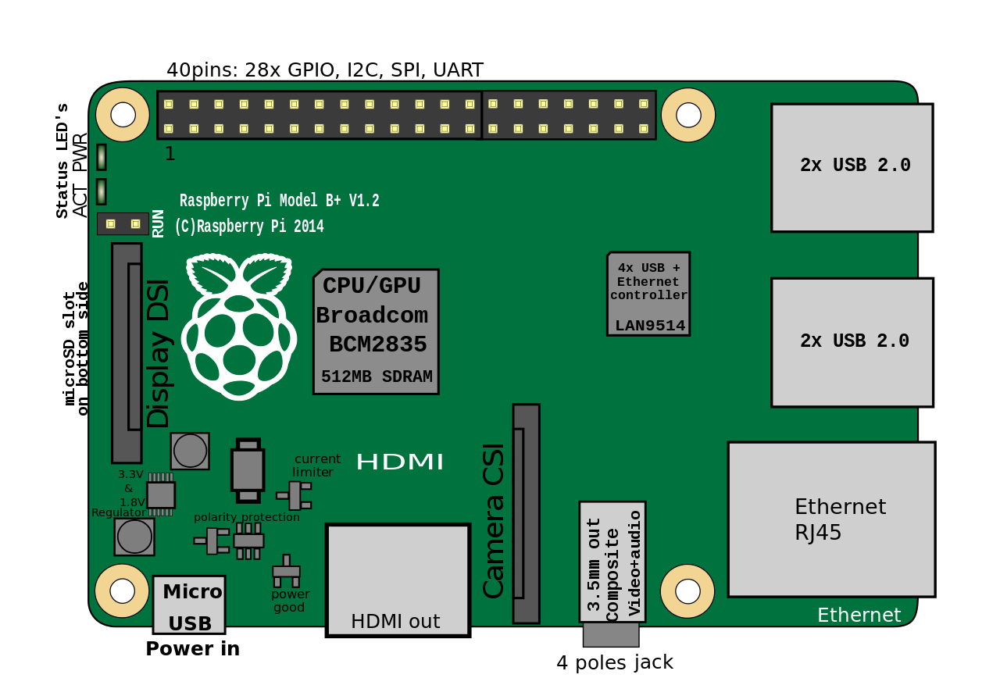
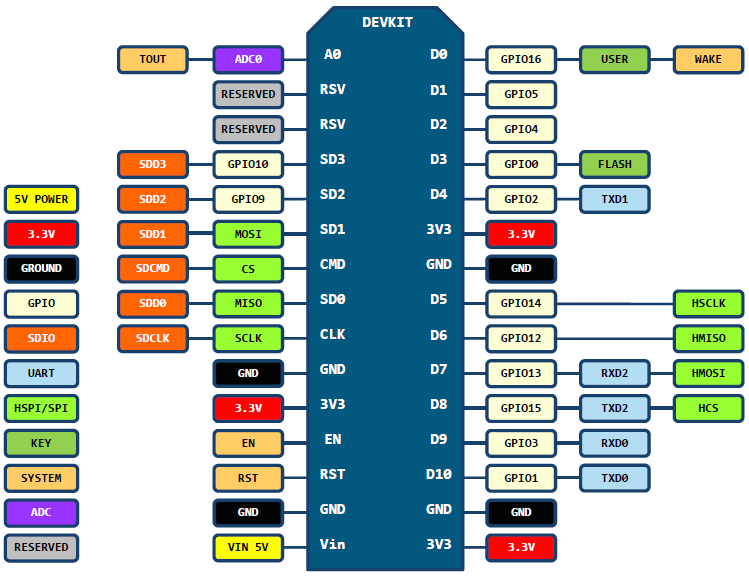

# Chapter 4. Hardware description

## Descripción del hardware

### Raspberry Pi 3

La Raspberry Pi 3 es la tercera generación de la placa computadora Raspberry Pi. Reemplazó al Raspberry Pi Modelo B 2 en febrero de 2016. En comparación con la Raspberry Pi 2 tiene:

-   Una CPU ARMv8 de 64-bit quad-core a 1.2GHz

-   802.11n Wireless LAN

-   Bluetooth 4.1

-   Bluetooth Low Energy (BLE)

Al igual que el Pi 2, también tiene:

-   1GB RAM

-   4 puertos USB

-   40 pines GPIO

-   Puerto HDMI

-   Puerto Ethernet

-   Conector de audio de 3,5 mm combinado y vídeo compuesto

-   Interfaz serie para camera (CSI)

-   Interfaz seria para pantalla (DSI)

-   Ranura para tarjeta micro SD

-   Procesador gráfico VideoCore IV 3D

La Raspberry Pi 3 tiene un factor de forma idéntica a la anterior Pi 2 (1 y Pi Modelo B +) y tiene una compatibilidad completa con Raspberry Pi 1 y 2.

### NodeMCU DEVKIT / D1 mini

NodeMCU es una plataforma de código abierto para IoT. Incluye firmware que se ejecuta en el SoC WiFi de Espressif (ESP8266), y hardware que se basa en el módulo ESP-12. El término "NodeMCU" por defecto se refiere al firmware en lugar de los kits de desarrollo.

Las especificaciones del SoC ESP8266 son las siguientes:

-   32-bit RISC CPU: Tensilica Xtensa LX106 funcionando a 80 MHz (se puede overclockear hasta 160MHz)

-   64 KiB de RAM de instrucciones, 96 KiB de RAM de datos

-   4 MiB de flash QSPI externa

-   IEEE 802.11 b/g/n Wi-Fi

-   Conmutador TR, balun, LNA, amplificador de potencia y red de adaptación integrados

-   Autenticación WEP, WPA/WPA2 o redes abiertas

-   16 pines GPIO

-   SPI, I²C,

-   Interfaces de I²S con DMA

-   2 UART en los pines dedicados, además de una UART de sólo transmisión se puede habilitar en GPIO2

-   1 ADC de 10 bits

La D1 mini es una placa wifi basada en ESP8266EX

-   11 pines GPIO; todos los pines tienen soporte para interrupción, PWM, I2C y OneWire (excepto D0)

-   1 entrada analógica (3.2V de entrada máx)

-   Una conexión micro USB

### iBoard / iBoard pro

Iboard es una placa compatible con Arduino que cuenta con un puerto Ethernet WIZnet con POE, un zócalo XBee, interfaz de módulo nRF24L01+, zócalo MicroSD y un ATMega328.

Iboard Pro es una placa compatible con Arduino que cuenta con un puerto Ethernet WIZnet con POE, un zócalo XBee, interfaz de módulo LCD serie/paralelo ITDB02, RTC, interfaz de módulo nRF24L01+, zócalo micro SD y un Atmega2560.

### Sensores y actuadores

## Descripción de la funcionalidad

### Especificación “Musquetteer”

Nodo central del sistema.

Genera la red wifi a la que se conectan los nodos “ESPutnik”. Sirve de pasarela entre esta red y la conexión a internet.

Hospeda el bróker MQTT.

Hospeda un servidor web.

### Especificación “ESPutnik”

Nodo terminal del sistema.

Se conecta a los sensores y actuadores.

Hospeda un servidor web ligero.
