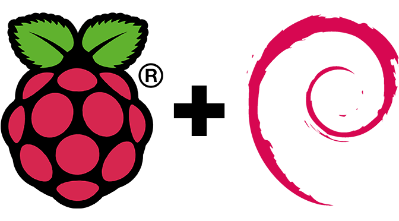

# Chapter 5. Software description

## Raspbian

Raspbian es un sistema operativo libre basado en Debian, optimizado para el hardware de Raspberry Pi.

## Eclipse Mosquitto

Eclipse Mosquitto™ es un bróker de mensajes de código abierto que implementa las versiones de protocolo MQTT 3.1 y 3.1.1. MQTT proporciona un método ligero de llevar a cabo la mensajería mediante un modelo de publicación / suscripción. Esto hace que sea conveniente para comunicaciones "Internet of Things" como con sensores de baja potencia o dispositivos móviles como teléfonos, ordenadores o microcontroladores embebidos como el Arduino.

## Custom firmware ESPutnik

### Objetivos de diseño

-   Parametrizable.

    -   Información del nodo

    -   Conexión de red

    -   Conexión MQTT

    -   Configuración de Entradas/Salidas

-   Configuración persistente

    -   Los valores configurados se almacenan en la memoria flash

    -   Los cambios en la configuración se aplican tras un reinicio del nodo

    -   Si la configuración es inválida o inexistente, durante el arranque se inicializan valores por defecto.

-   Modos de funcionamiento.

    -   CONFIG

    -   STANDALONE

    -   NETWORKED

-   Actualizaciones OTA

-   Página web de administración o API REST

### Flowcharts

